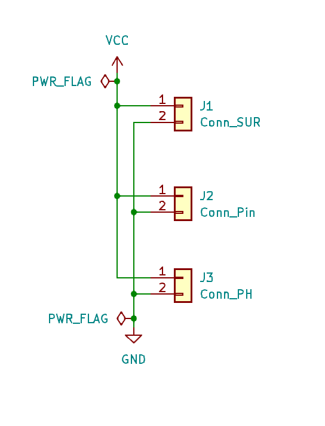
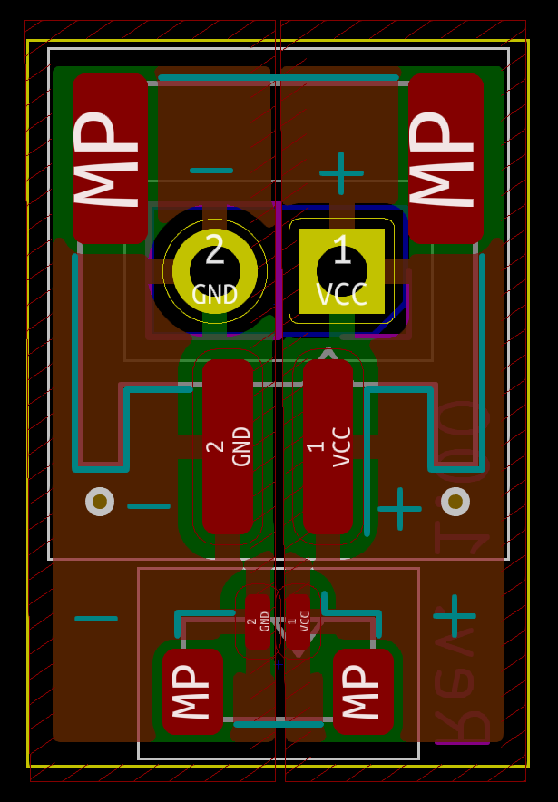
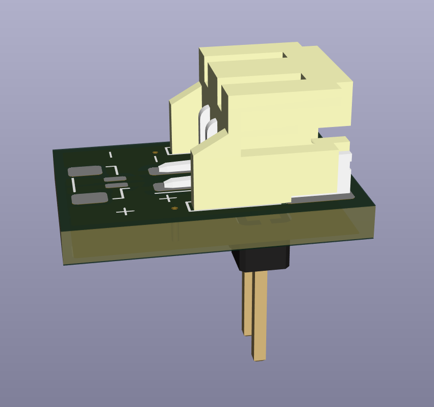

Small Adapter from JST-SUR (2pin) to Pin-Header
===============================================

This is a small adapter for Lego lighting kits that use
JST-SUR connectors.

You can add a PH2, XH2.54-2 or 2-pin DuPont socket/header.

Schematic
---------

Layout
------

3D-View
-------

Note: there is no 3D-file for the SUR-Adapter, so this part
is missing in this image:

License
-------

[![CC BY-SA 4.0][cc-by-sa-shield]][cc-by-sa]

This work is licensed under a
[Creative Commons Attribution-ShareAlike 4.0 International
License][cc-by-sa].

[![CC BY-SA 4.0][cc-by-sa-image]][cc-by-sa]

[cc-by-sa]: http://creativecommons.org/licenses/by-sa/4.0/
[cc-by-sa-image]: https://licensebuttons.net/l/by-sa/4.0/88x31.png
[cc-by-sa-shield]:
https://img.shields.io/badge/License-CC%20BY--SA%204.0-lightgrey.svg
